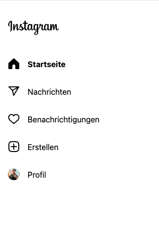

# FocusFeed: Streamlined Social Browsing

A powerful Chrome extension designed to enhance your productivity by providing granular control over distracting elements on popular social media platforms. Take control of your browsing experience on YouTube and Instagram with customizable content filtering options.

## Features

### YouTube Customization
- **Home Feed Control**: Automatically redirect the YouTube homepage to your Subscriptions feed
- **Recommendation Blocking**: Remove suggested videos from the sidebar
- **Comment Section Toggle**: Hide comments to avoid distracting discussions
- **Shorts Removal**: Disable YouTube Shorts to stay focused on regular content
- **Grayscale Thumbnails**: Convert video thumbnails to grayscale to reduce visual distraction
- **Clean Navigation**: Streamlined interface with reduced distractions


*YouTube with grayscale thumbnails enabled*

### Instagram Customization
- **Explore Feed Control**: Disable the Instagram Explore feed to avoid endless browsing
- **Reels Management**: Option to hide Instagram Reels
- **Focused Browsing**: Stay connected with friends without getting lost in suggested content


*Instagram with explore feed and reels disabled*

## Installation

### Chrome Web Store (Recommended)
1. Visit the Chrome Web Store
2. Search for "FocusFeed: Streamlined Social Browsing"
3. Click "Add to Chrome"

### Manual Installation (Developer Mode)
1. Clone the repository:
```bash
git clone https://github.com/SebastianBoehler/productivity-extension.git
```
2. Open Chrome and navigate to `chrome://extensions/`
3. Enable "Developer mode" in the top right
4. Click "Load unpacked" and select the extension directory

## Usage
1. Click the extension icon in your Chrome toolbar
2. Toggle the features you want to enable/disable for each platform
3. Refresh your YouTube or Instagram tabs for changes to take effect

## Privacy & Permissions
- The extension only requires permissions for YouTube and Instagram domains
- No user data is collected or transmitted
- All settings are stored locally in your browser

## Contributing
Contributions are welcome! Feel free to:
- Report bugs
- Suggest new features
- Submit pull requests

## License
This project is open source and available under the MIT License.

## Support
If you encounter any issues or have suggestions, please open an issue on GitHub.
